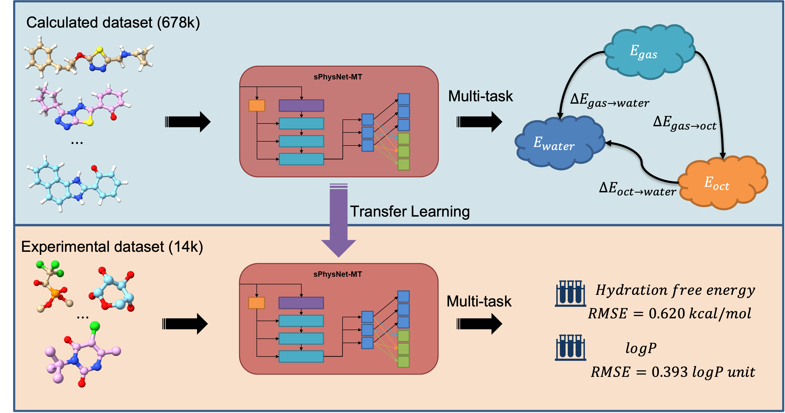

# Multi-task Deep Ensemble Prediction of Molecular Energetics in Solution: From Quantum Mechanics to Experimental Properties

This is the official implementation of the [paper](https://pubs.acs.org/doi/full/10.1021/acs.jctc.2c01024) published in JCTC.


## Environment Setup

### 1. If you are using Linux and Conda

Create a new conda environment with python 3.8:

`conda create -n sphysnet-mt python==3.8 -y`

`conda activate sphysnet-mt`

Install the required packages:

`bash bash_scripts/install_env_linux.bash`

### 2. If you are on other systems or are using other package managers

 please install the following packages by checking their websites.

- [PyTorch](https://pytorch.org/)
- [PyTorch geometric](https://pytorch-geometric.readthedocs.io/en/latest/notes/installation.html)
- [Rdkit](https://www.rdkit.org/docs/Install.html)
- [TreeLib](https://pypi.org/project/treelib/)
- [ASE](https://pypi.org/project/ase/)

## Run Prediction

Download the trained models:

`bash bash_scripts/download_models_and_extract.bash`

The script requires a SDF file which contains the 3D geometry of the molecule. For example, to predict the experimental hydration free energy and logP of aspirin:

`python predict.py --sdf data/aspirin.mmff.sdf --model exp_ens5`


```
E_hydration: -8.706545270452128 +- 0.07050703507346 kcal/mol
LogP: 0.9404807601870087 +- 0.1834077032423927
```

You can provide your own sdf file. Since our model are trained on MMFF optimized geometry with explicit hydrogens, we recommend adding hydrogens and performing MMFF optimization before the prediction.

There are three model options:

- `cal_single`: a single model trained on Frag20-solv-678k which predicts the DFT-level energies in gas, water and octanol
- `cal_ens5`: an ensemble of 5 models trained on Frag20-solv-678k which predicts the DFT-level energies in gas, water and octanol
- `exp_ens5`: an ensemble of 5 models finetuned on FreeSolv-PHYSPROP-14k which predicts experimental level hydration free energy and logP

## Model Training

### 1. Dataset preprocess

This script downloads the raw data (labels and geometry files) from [our website](https://yzhang.hpc.nyu.edu/IMA/). The downloaded data will be stored in `./data/raw`

`bash bash_scripts/download_data_and_extract.bash`

Preprocess the calculated dataset (Frag20-solv-678k). This step takes around 4 hours on 12 CPUs and 35GB of memory.

`bash bash_scripts/preprocess_frag20_678k.bash`

Preprocess the experimental dataset (FreeSolv-PHYSPROP-14k). This step takes around 6 minutes on 2 CPUs.

`bash bash_scripts/preprocess_freesolv_physprop_14k.bash`

### 2. Train sPhysNet-MT on the calculated dataset (Frag20-solv-678k)

Train a sPhysNet-MT from scratch. It is recommended to use 30GB memory to train on Frag20-solv-678k.

`bash bash_scripts/train_from_config.bash configs/config-frag20sol.txt`

Train a ensemble of 5 models from scratch on the calculated dataset.

`bash bash_scripts/train_ens_from_config.bash configs/config-frag20sol.txt`

### 3. Train sPhysNet-MT on the experimental dataset (FreeSolv-PHYSPROP-14k)

Fine-tune the pretrained model on FreeSolv-PHYSPROP-14k using 50 random splits and 5 ensembles.

`bash bash_scripts/train_rd_split_from_config.bash configs/config-freesolv_physprop.txt`

## Model Evaluation

After training, you will find the trained folder in the current directory: `./exp_*_run_*` (single run), `./exp_*_active_ALL_*` (ensemble) or `./exp_*_RDrun_*` (random split). Those folders contain all the information about the model training as well as the model with the lowest evaluation loss. 

To evaluate the performance on a single run folder:

`bash bash_scripts/test.bash $SINGLE_RUN_FOLDER`

Replace `$SINGLE_RUN_FOLDER` with the folder path you actually get, for example:

`bash bash_scripts/test.bash exp_frag20sol_run_2022-11-26_205046__623751`

You will find a test folder `exp_*_test_*` generated inside the run folder. Inside the test folder you will find a log file `test.log`, two `loss_*.pt` file which contains the raw predictions by the model. The `*.pt` files can be read by `torch.load()`.

To evaluate the performance on an ensemble run folder:

`bash bash_scripts/test.bash $ENSEMBLE_RUN_FOLDER/exp*`

To evaluate the performance on a random split run folder:

`bash bash_scripts/test.bash $RANDOM_SPLIT_RUN_FOLDER/exp*/exp*`
